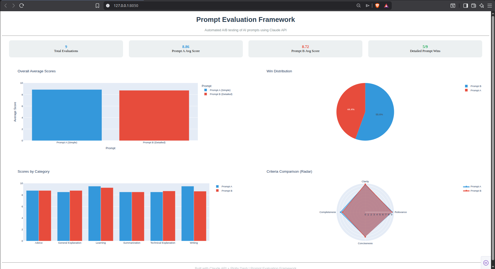
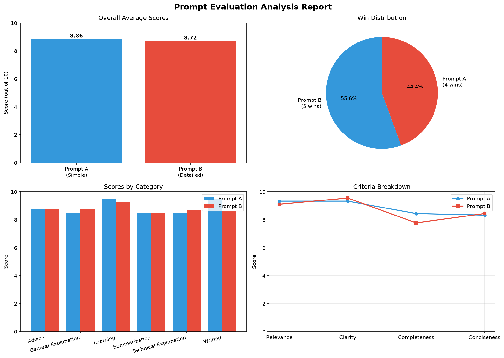

#  Prompt Evaluation Framework

An automated A/B testing framework for AI prompts using the Claude API.
Evaluates and compares prompt quality across multiple criteria and 
generates visual reports.

---

## 🎯 What It Does

Most people use AI without knowing if their prompts are actually good.
This framework automatically tests two versions of a prompt for the same
task and tells you which one produces better results — and why.

---

## 🔄 How It Works
User provides 2 prompts for same task

↓

Both sent to Claude API (claude-haiku)

↓

Claude scores each response on 4 criteria

↓

Scores saved to CSV

↓

Analysis run with Pandas

↓

Interactive dashboard built with Plotly Dash

↓

Winner declared with insights
---

## 📊 Evaluation Criteria

Each response is scored 1–10 on:

| Criteria | Description |
|---|---|
| **Relevance** | Did it answer the task? |
| **Clarity** | Is it easy to understand? |
| **Completeness** | Did it cover everything? |
| **Conciseness** | Is it the right length? |

Final score = average of all 4 criteria.

---

## 🛠️ Tech Stack

| Tool | Purpose |
|---|---|
| Python | Core language |
| Claude API (Haiku) | AI responses + scoring |
| Pandas | Data analysis |
| Matplotlib | Static charts |
| Plotly Dash | Interactive dashboard |
| CSV | Data storage |
| Git/GitHub | Version control |

---

## 📁 Project Structure
prompt-evaluation-framework/

│

├── data/

│   ├── results.csv          # All evaluation results

│   └── analysis_charts.png  # Generated charts

│

├── src/

│   ├── evaluator.py         # Core evaluator + Claude API

│   ├── analysis.py          # Pandas analysis + charts

│   └── dashboard.py         # Plotly Dash dashboard

│

├── .env                     # API key (not pushed)

├── .gitignore

└── README.md
---

## 🚀 Getting Started

### 1. Clone the repo
```bash
git clone https://github.com/YOURUSERNAME/prompt-evaluation-framework.git
cd prompt-evaluation-framework
```

### 2. Create virtual environment
```bash
python3 -m venv venv
source venv/bin/activate
```

### 3. Install dependencies
```bash
pip install anthropic python-dotenv plotly dash pandas matplotlib
```

### 4. Add your API key
```bash
echo "ANTHROPIC_API_KEY=your_key_here" > .env
```

### 5. Run evaluator
```bash
cd src
python3 evaluator.py
```

### 6. Run analysis
```bash
python3 analysis.py
```

### 7. Launch dashboard
```bash
python3 dashboard.py
```
Open browser → http://127.0.0.1:8050

---

## 📈 Sample Results

### Dashboard Preview


### Analysis Charts


After running evaluations across categories:

- Detailed prompts won **5/9** evaluations
- Biggest improvement area: **Clarity**
- Best category for detailed prompts: **Learning**


---

## 💡 Key Insight

> More specific, context-rich prompts consistently produce
> higher quality AI responses — especially for technical
> explanations and structured writing tasks.

---

## 🔧 Supported Models

Easily switch between Claude models:
```python
# In evaluator.py
get_response(prompt, model="claude-haiku-4-5-20251001")   # Fast, cheap
get_response(prompt, model="claude-sonnet-4-6")           # Higher quality
```

---

## 👤 Author

**Ajith J**
- 📧 ajmarar005@gmail.com
- 💼 [LinkedIn](https://www.linkedin.com/in/ajith-j3)
- 🎓 BTech CSE, Adi Shankara Institute of Engineering and Technology

---

## 📄 License

MIT License — free to use and modify.
